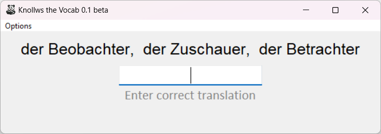
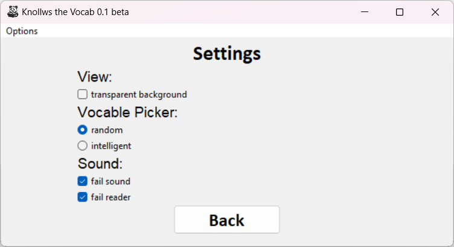
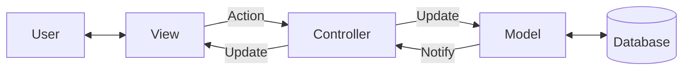
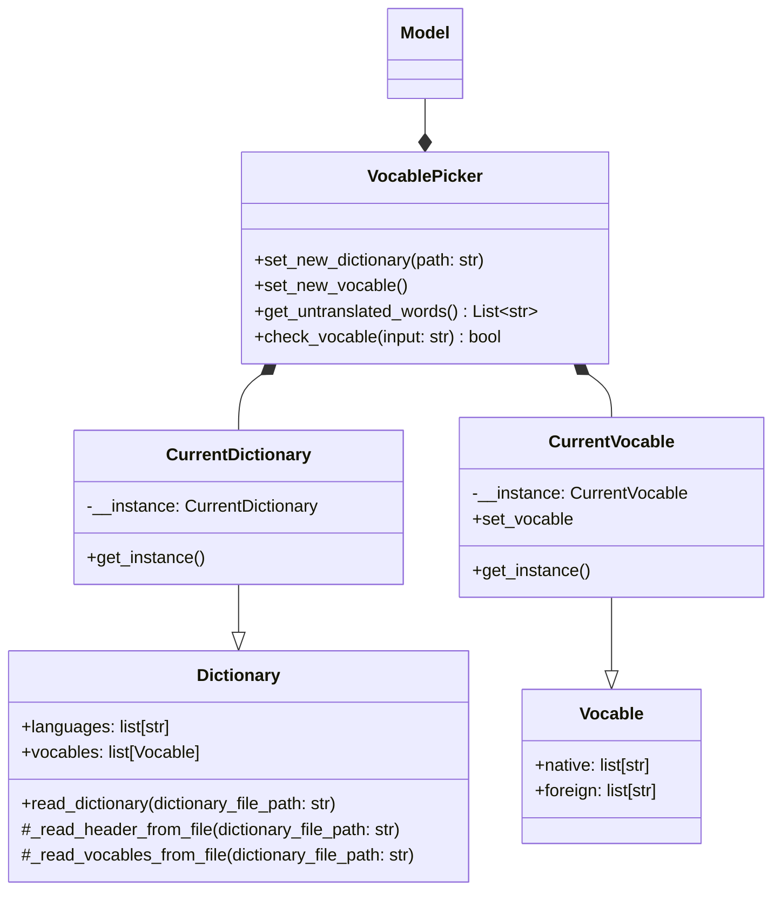
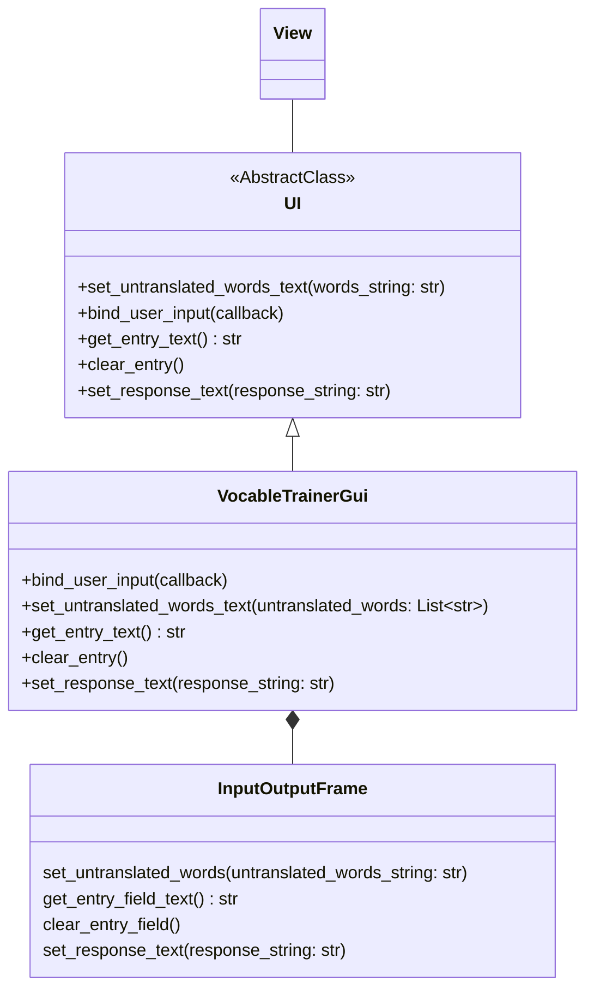
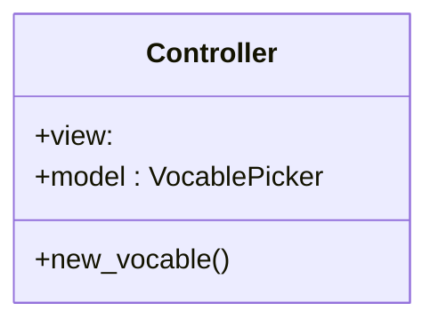

# Knollws the Vocab - VocableTrainer

## Description

A simple program to practice vocabulary. The vocabularies are read from a simple CSV file.

## Screenshots

## Design

This is a redesign with the MVC-Pattern. This leads to a better decoupling between the modules.

## Model

## View

## Controller

